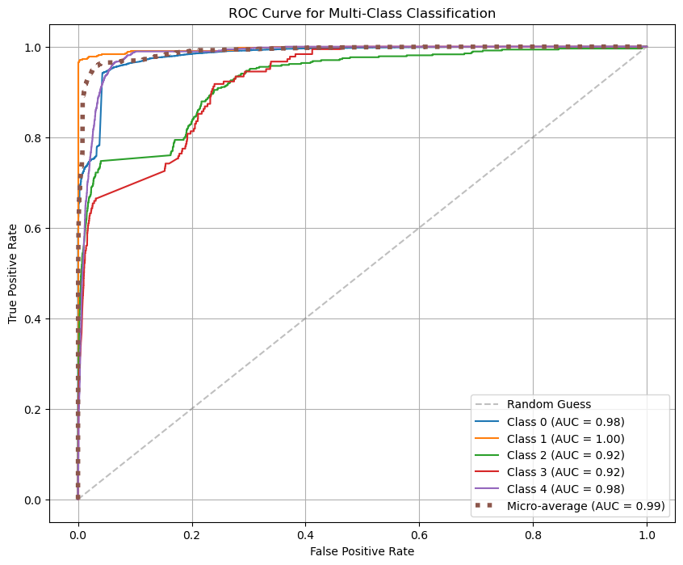
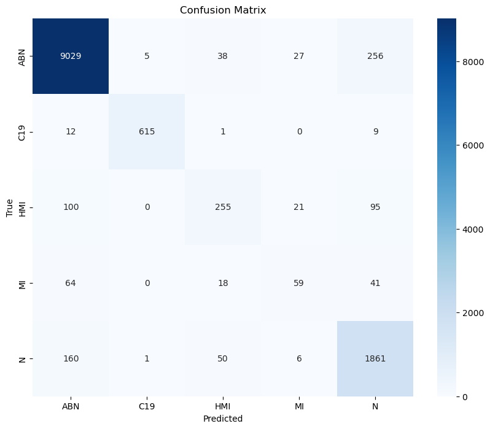
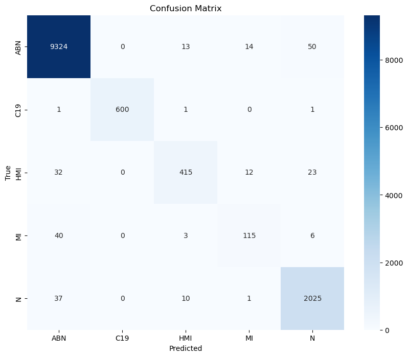
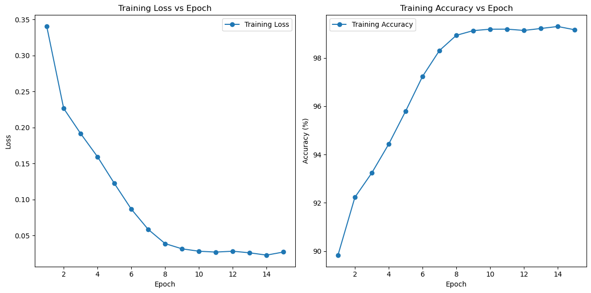
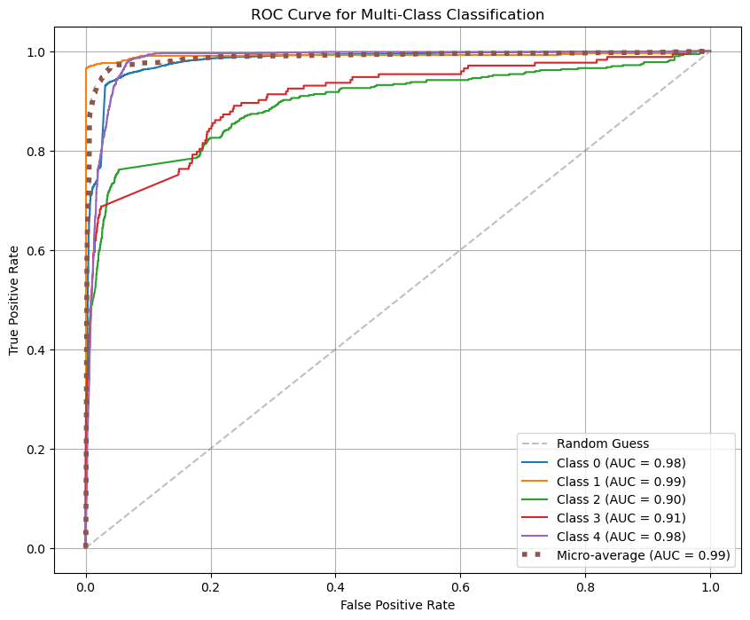
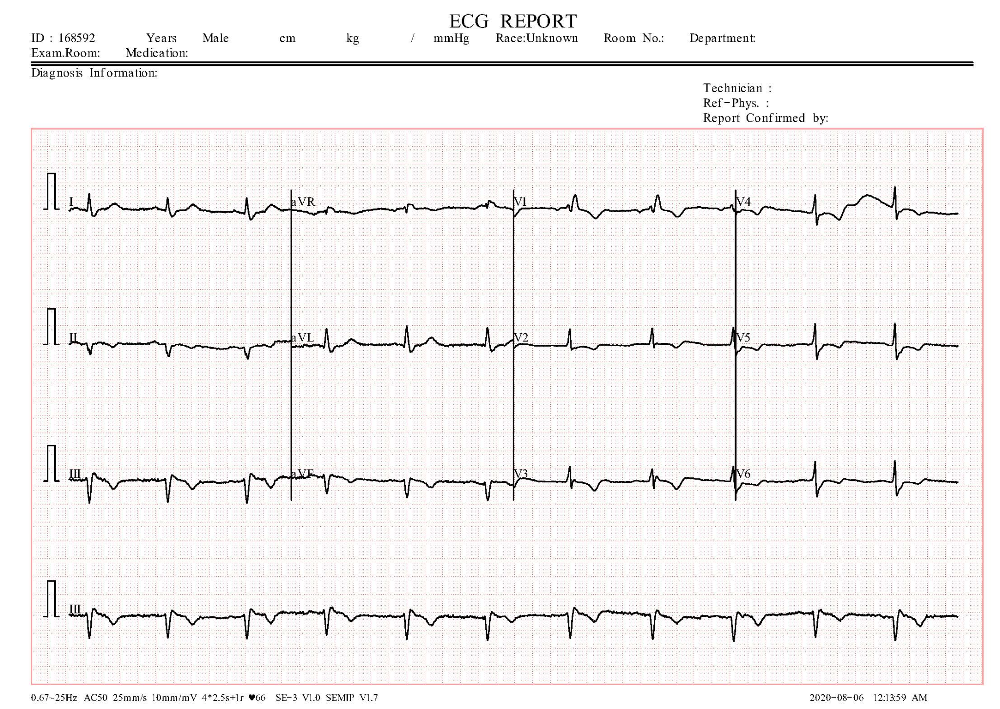
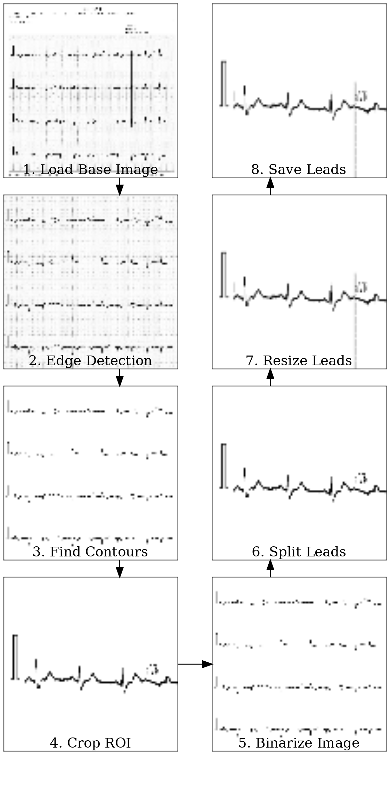

# VIT Data Comparison

## Models

- [1] Google ViT Base (imagenet21k)
- [2] Google ViT Base + ResNet50 (imagenet21k) Ensemble
- [3] Google ViT Base + ResNet18 (imagenet21k) Ensemble

### Data

| Model | Setup | Accuracy | F1  | Avg ROC-AUC | Precision | Recall |
|-------|-------|----------|-----|-------------|-----------|--------|
| [1]   | Holdout 80/0/20 | 0.928 | 0.926 | 0.990       | 0.939    | 0.942  |
| [2]   | Holdout 80/0/20 | 0.980 | 0.980 | 0.998       | 0.989   | 0.980  |
| [3]   | Holdout 80/0/20 | 0.937 | 0.933 | 0.987       | 0.940    | 0.947  |

### Metrics

#### Google ViT Base

- **Batch Size**: 80
- **Epochs**: 13
- **Learning Rate**: 9e-6
- **Optimizer**: AdamW

Training Loss and Accuracy

ROC-AUC

Confusion Matrix

#### Google ViT Base + ResNet50

- **Batch Size**: 80
- **Epochs**: 15
- **Learning Rate**: 9e-6
- **Optimizer**: AdamW

- Training Loss and Accuracy

- ROC-AUC

- Confusion Matrix

### Google ViT Base + ResNet18

- **Batch Size**: 80
- **Epochs**: 15
- **Learning Rate**: 9e-6
- **Optimizer**: AdamW

Training Loss and Accuracy

ROC-AUC

Confusion Matrix

### Explanation of Performance

*Google ViT Base*

The Vision Transformer (ViT) model leverages the transformer architecture, which has shown significant success in natural language processing tasks. When applied to vision tasks, ViT breaks an image into a sequence of patches and processes them similarly to how words are processed in NLP models. This approach allows ViT to capture long-range dependencies and complex patterns within the image, resulting in high accuracy and a strong ROC-AUC score.

#### Google ViT Base + ResNet50 Ensemble

Combining ViT with ResNet50 aims to leverage the strengths of both architectures. ResNet50 is a deep convolutional neural network that excels in extracting detailed features from images. The ensemble model combines the robust feature extraction of ResNet50 with the comprehensive pattern recognition of ViT. However, in this case, the ensemble showed a slight decrease in performance compared to the standalone ViT. This could be due to potential overfitting or the challenge of effectively integrating the outputs from two different architectures.

#### Google ViT Base + ResNet18 Ensemble

Similar to the ResNet50 ensemble, the ResNet18 ensemble combines the strengths of ViT and ResNet18. ResNet18, being a smaller and less complex network compared to ResNet50, might complement ViT without introducing as much complexity, resulting in performance metrics very close to the standalone ViT. This suggests that ResNet18 is able to provide useful complementary features without significantly increasing the risk of overfitting or integration issues.

### Preprocessing

The preprocessing steps are critical for ensuring that the data fed into the models is clean, consistent, and appropriately formatted. The preprocessing pipeline includes:

1. **Data Cleaning**: Removing noise, correcting labels, and handling missing values.
2. **Normalization**: Scaling pixel values to a range suitable for the model, typically between 0 and 1.
3. **Data Augmentation**: Applying random transformations such as rotations, flips, and shifts to increase the diversity of the training dataset and improve generalization.
4. **Patch Extraction**: For ViT, the image is divided into fixed-size patches, each treated as a token input to the transformer.

### Download Links

- **Google ViT Base Weights**: [Download ViT Weights](./model_weights/ViTModel)
- **Google ViT Base + ResNet50 Weights**: [Download ViT + ResNet50 Weights](./model_weights/Resnet50_VIT_ENSEMBLE)
- **Google ViT Base + ResNet18 Weights**: [Download ViT + ResNet18 Weights](NOT THERE YET)

### Conclusion

This comparison highlights the strengths and potential trade-offs of using different model architectures for image classification tasks. The standalone Google ViT Base model demonstrates superior performance, likely due to its ability to capture complex patterns and dependencies within images. The ensemble models, while slightly lagging in performance metrics, offer insights into how integrating different architectures can complement each other and potentially enhance specific aspects of model performance. The preprocessing steps ensure that the data is optimally prepared for training, contributing to the overall effectiveness of the models.
