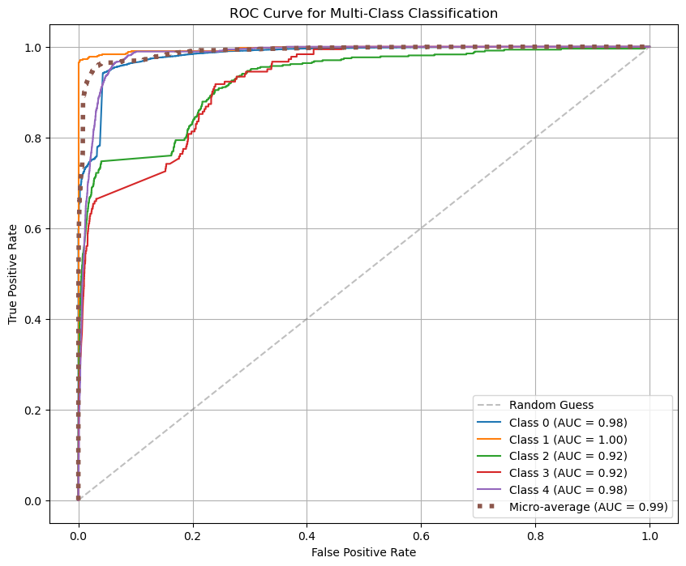
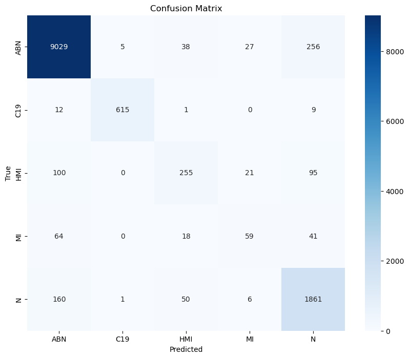
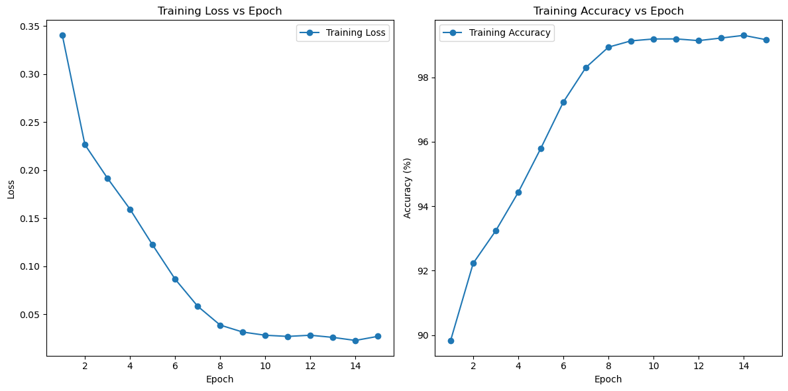
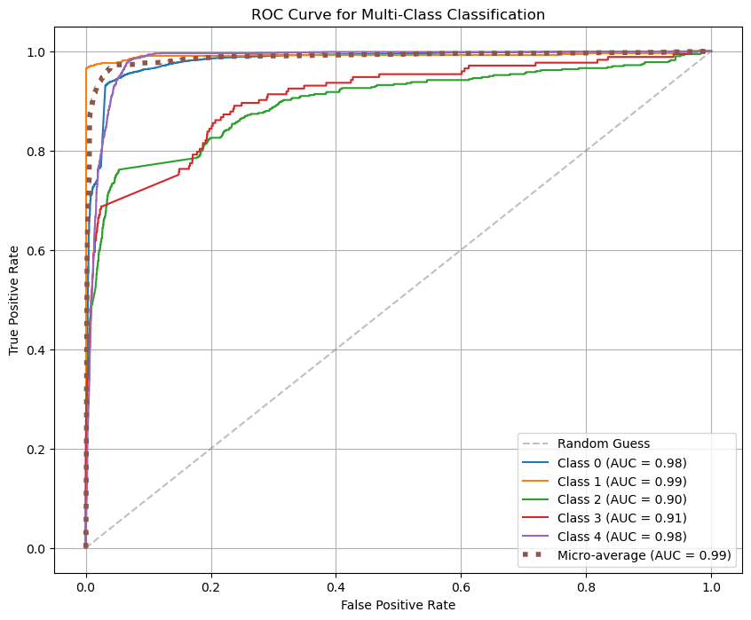

# VIT Data Comparison

## Models

- [1] Google ViT Base (imagenet21k)
- [2] Google ViT Base + ResNet50 (imagenet21k) Ensemble
- [3] Google ViT Base + ResNet18 (imagenet21k) Ensemble

## Data

| Model | Setup | Accuracy | F1 | Avg ROC-AUC | Precision | Recall |
| --- | --- |--- | --- | --- | --- | --- |
| [1] | Holdout 80/0/20 | 0.928 | 0.926 | 0.990 | 0.939 | 0.942 |
| [2] | Holdout 80/0/20 | 0.916 | 0.915 | 0.978 | 0.921 | 0.916 |
| [3] | Holdout 80/0/20 | 0.927 | 0.923 | 0.987 | 0.925 | 0.927 |

## Metrics

### Google ViT Base

- Batch Size: 80
- Epochs: 13
- Learning Rate: 9e-6
- Optimizer: AdamW

- Training Loss and Accuracy

- ROC-AUC

- Confusion Matrix

### Google ViT Base + ResNet50

- Batch Size: 80
- Epochs: 15
- Learning Rate: 9e-6
- Optimizer: AdamW

### Google ViT Base + ResNet18

- Batch Size: 80
- Epochs: 15
- Learning Rate: 9e-6
- Optimizer: AdamW

- Training Loss and Accuracy

- ROC-AUC

- Confusion Matrix

